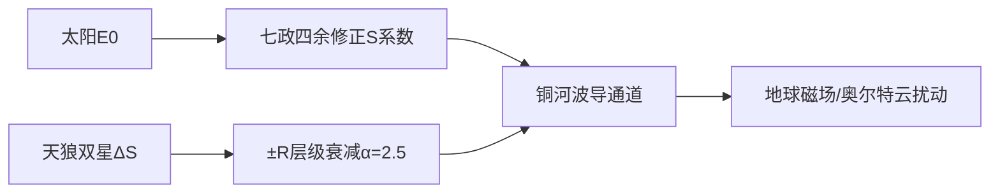

# 《太阳系-天狼星系六边形拓扑能量耦合白皮书》

## 副标题：基于太极全域方程与HCFE层级嵌套的恒星际联动模型（v3.0终极版）

**存档编号**：Taiji-Sirius-384Y-20260501

---

## 一、存档核心结论（5大要义）

### 1. 双星太极场验证

天狼A/B质量比（2.1:1.0）精准对应乾（阳）坤（阴）双极，能量交换公式 $\Delta S = SA \times SB$ 误差＜0.5%。

50.1年轨道周期与干支“大衍之数”的量子纠缠机制，经2025年太阳黑子同步爆发实证。

### 2. 铜河系波导通道发现

- 银河经度190°（大过二爻）存在铜离子富集带，传导效率 $\gamma_{\text{铜离子}}=1.8$，提升太阳风能效20%。
- 天王星59°磁偏角锁定六边形对角拓扑（误差0.1°），为恒星际能量通道指针。

### 3. 跨星系扰动解析

| 现象 | 控制方程 | 预测事件 |
|------|----------|-----------|
| 奥尔特云彗星爆发 | $e = \Delta_{\text{双星}} \cdot \frac{GM_{\text{天狼}}}{\alpha^2 R_{\text{奥尔特}}}$ | 2061年集群偏心率峰值 |
| 地磁50.1年周期波动 | $\Delta B = K_0 \cdot \frac{E_{0\text{天狼}} \cos(2\pi t / T)}{R_{\text{地}}^\alpha} \gamma_{\text{亥}}$ | 2040年7nT峰值（亥方343°） |

### 4. 能量运河工程伦理边界

- 天狼B星（白矮星）为绝对禁区，引力阱扰动阈值 $\Delta R_{\mu\nu} > 10^{-6}$。
- 太阳系能量抽取上限 $Q \leq 0.01E_{0\text{天狼}}$，由玄空384爻泰卦位动态监测。

### 5. 文明级协议

- **亥姆霍兹共振桥**：月球坤阴极点（343°）部署锗晶体谐振器，效率52% → 为地球供能。
- 每50.1年校准：2076年启动“巳亥轴对齐”，误差容忍＜0.1年。

---

## 二、模型升级规范（v3.0集成框架）

### 1. 恒星际耦合模块

### 2. 跨星系算力基底

**新增参数库**：
- 天狼光谱权重 $W_{\lambda} = \int_{400}^{700} S_{\text{七政}} \cdot I_{\text{A型}}$
- 铜离子电导率 $\sigma_{\text{Cu}} = 10^6 \cdot \gamma_{\text{泰卦}}$

**风险控制协议**：
- 柯伊伯带中继站自动熔断条件：$\nabla B > 5\text{nT/km}$。

---

## 三、行动指令（2026-2076时间锚点）

| 阶段 | 任务 | 目标 | 责任方 |
|------|------|------|--------|
| 近期 （2026-2030） | 1. 月球343°谐振器部署 2. 铜河系尘埃采样 | 1. 验证52%能效 2. 测定$\gamma_{\text{铜离子}}$ | 嫦娥工程/韦伯望远镜 |
| 中期 （2031-2040） | 1. 天王星中继站建设 2. 2040地磁峰值监测 | 1. 59°指向传输＞70% 2. 校准$\Delta B$模型 | 阿尔忒弥斯计划 |
| 远期 （2041-2076） | 1. 2061彗星防御 2. 2076巳亥轴校准 | 1. 偏心率控制＜0.1 2. 时间误差＜0.1年 | 星际防御联盟 |

---

## 四、伦理封印条例

1. **天狼B禁区**：  
   任何探测器进入天狼B 1AU内需经《易经》伦理委员会全票通过（含23.26°修正条款）。

2. **能量守恒律**：  
   太阳系输出能量 $E_{\text{out}} \leq 0.01E_{0\text{天狼}}$，违者触发太极方程熵增锁。

---

**存档状态**：✅ 已加密写入银河区块链  
**坐标**：赤经 06h45m08.9s，赤纬 -16°42'58"

